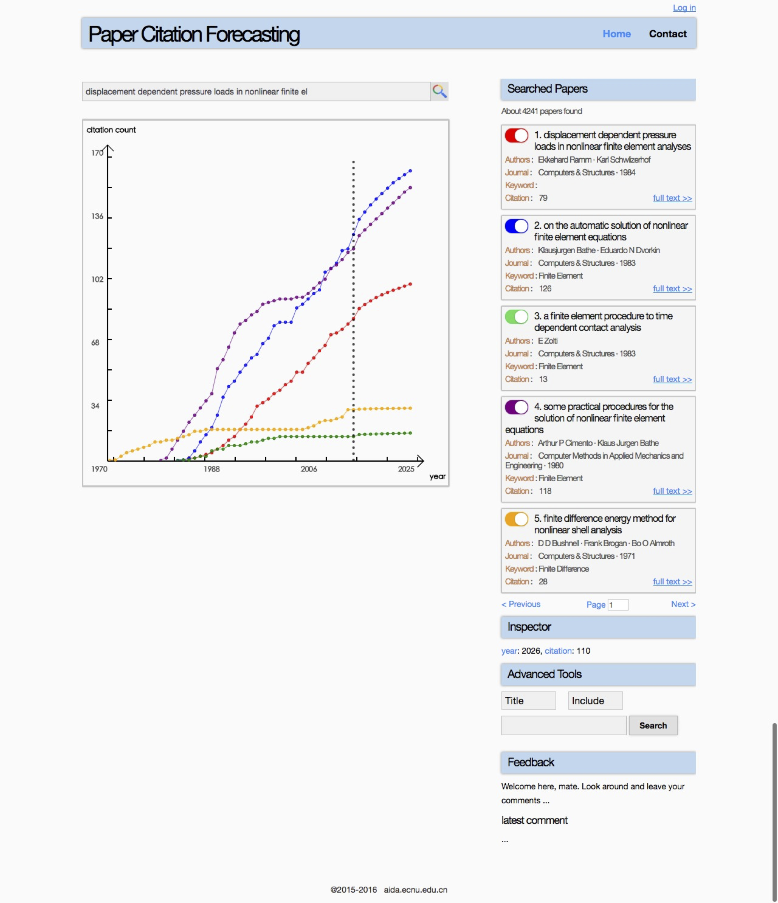

### Citation Forecasting

####1.简介
论文引用次数预测Demo，基于微软学术图历史数据预测论文引用次数上升趋势, 囊括了前端、后台、模型。
项目基于Tornado。

####2.模块&组件

./main.py 主文件

./common_config/* 包含全局配置文件

./controller/* 定义了处理请求的步骤，包含API对应的request handler

./service/* 定义了搜索论文、预测引用次数预测、训练模型模型的核心步骤，这些步骤被封装为基础服务

./service/train/*  定义了训练模型的核心算法步骤

./static/* 包含CSS、JS等静态文件

./template/*  定义了前端文件，包含Tornado模板

####3.部署需求

未来为利用容器简化部署过程。目前需要手动安装各个依赖包。

1. python 2.7.10
2. numpy 1.7.1
3. tornado 4.3
4. Java 1.8 （需要Oracle官方版本）
5. solr 6.0
6. pysolr 3.3

####4.部署方法：

######1.下载本项目

首先要下载整个项目，务必解压到全英文路径的目录中。

######2.部署solr引擎

部署并启动solr引擎，然后在solr中新建一个文档集，确保solr的访问url为 http://localhost:8983/solr/paper

注：

solr相关命令如下：

启动$ bin/solr start -cloud -noprompt

建立索引 $ bin/solr create -c paper

关闭 $ bin/solr stop -all && rm -Rf example/cloud/

全文检索 $ bin/post -c gettingstarted docs/

######3.建立索引

建立搜索引擎索引用于文章搜索，在终端输入 

$ python ./service/train/build_index.py。

######4.启动预测引擎

运行程序，在终端输入

$ python ./main.py

然后在浏览器打开

http://localhost:8911

注：

对params.json文件，运行./service/train/train.py 生成

对数据集文件.csv等， 运行 ./service/train/ldp_fea.py 生成

对./service/train/academic.db文件，需要通过build_index.py中的select_paper()函数生成

####5.截图

####6.Reference

X Liu, J Yan, S Xiao, X Wang, H Zha, S Chu. On Predictive Patent Valuation: Forecasting Patent Citations and Their Types. AAAI 2017.

S Xiao, J Yan, C Li, B Jin, X Wang, H Zha, X Yang, MC Stephen. On modeling and predicting individual paper citation count over time. IJCAI 2016.

